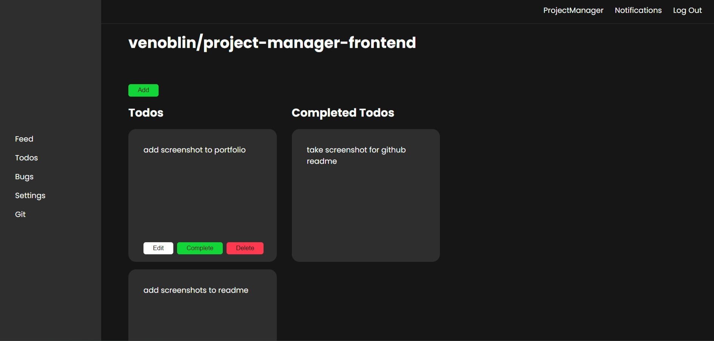

 

<h3 align="center">TeamHub</h3>

 Web-application built to help you organize your projects !
 
 
<a href="https://projectmanagerweb.netlify.app/">View Demo</a> .  
<a href="https://github.com/venoblin/project-manager-backend">Back-End</a>  

Table of Contents

- [About The Project](#about-the-project)
  - [Built With](#built-with)

## About The Project

  

  

  

  

  

TeamHub is a web application that allows you to organize your projects and most importantly your workflow. By laying out everything in a single place it will allow you to better keep up with tasks and what's going on with the project in general.

### Built With

This project was built with the following technologies:
- 
- 
- 
- 
- 
- 
