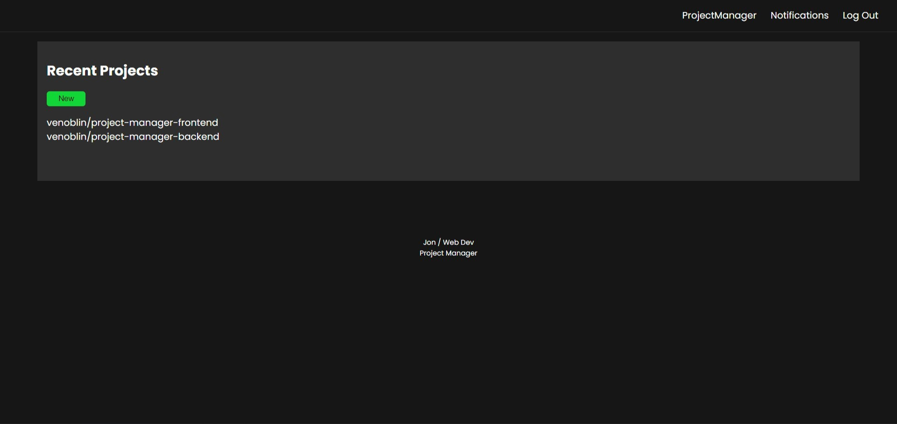
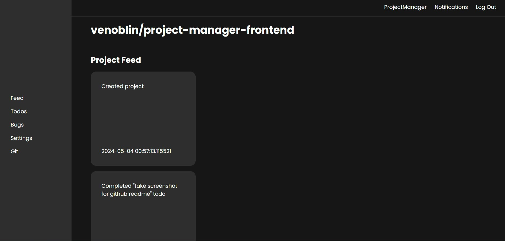
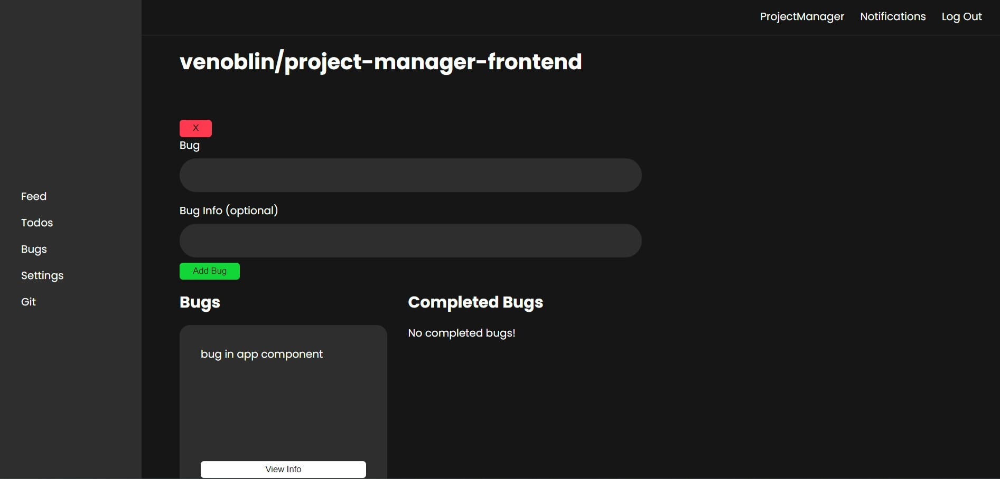
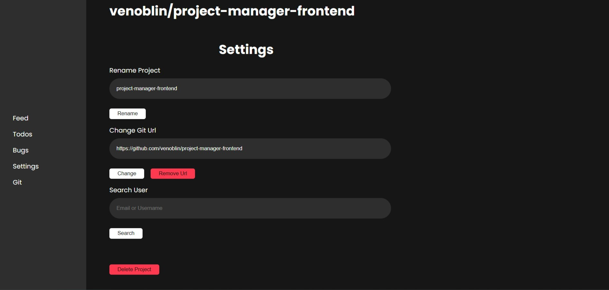

[LinkedIn](https://www.linkedin.com/in/jonathanvillagomezhernandez/) |
[Website](https://www.jonweb.dev/)

<!-- PROJECT LOGO -->
 

  <h1 align="center">Project Manager</h3>

  

    Web-application built to help you organize your projects
     
    <a href="https://projectmanagerweb.netlify.app/">
    <strong>View Demo</strong></a> | <a href="https://github.com/venoblin/project-manager-backend"><strong>Back-End</strong></a>
     
  

<!-- TABLE OF CONTENTS -->

  
Table of Contents

  <ol>
    <li>
      <a href="#about-the-project">About The Project</a>
      <ul>
        <li><a href="#built-with">Built With</a></li>
      </ul>
    </li>
    <li><a href="#roadmap">Roadmap</a></li>
  </ol>

<!-- ABOUT THE PROJECT -->
## About The Project

  

  

  

  

  

Project Manager is what its name implies, it allows you to organize your projects and most importantly your workflow. By laying out everything in a single place it will allow you to better keep up with tasks and what's going on with the project in general.

(<a href="#readme-top">back to top</a>)

### Built With

* React
* TypeScript
* SCSS
* Python
* Flask
* PostgreSQL
* SQLAlchemy

(<a href="#readme-top">back to top</a>)

<!-- ROADMAP -->
## Roadmap

- [ ] Add image support for project information
- [ ] Add multiple contributers to single project
- [ ] Add a ticket system to organize multiple contributers

(<a href="#readme-top">back to top</a>)

